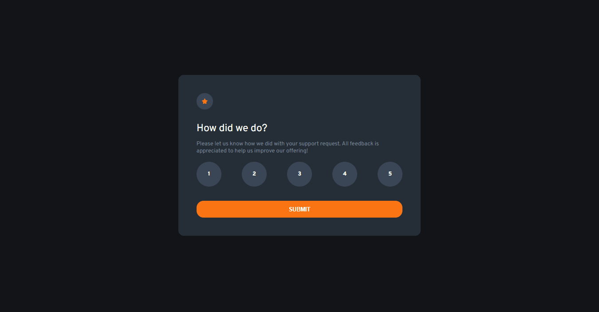
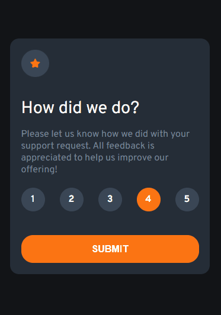

# Desafio Componente de Avaliação - Frontend-Mentor

Este é um desafio de um componente de avaliação proposto pelo site Frontend-Mentor.

## Tabela de Conteúdos

- [Visão Geral](#visão-geral)
    - [Imagens](#imagens)
    - [Link da página](#link)
- [Processo](#processo)
    - [Linguagens utilizadas](#linguagens-utilizadas)
    - [O que aprendi](#o-que-aprendi)
    - [Possíveis evoluções](#possíveis-evoluções)
- [Autor](#autor)

## Visão-geral

### Imagens

<br>

````
Versão de Desktop
````

   

<br>

````
Versão Mobile
````

 

### Link

- Página no GitHub Pages: <a href="https://julio-mansan2.github.io/componente-de-avaliacao/">Clique aqui!</a>

## Processo

### Linguagens utilizadas

<br>

- Marcações semânticas de HTML5
- Propriedades de customização do CSS3
- Estruturas de JavaScript

<br>

### O que aprendi

<br>

- Adicionar textos ao HTML utilizando JS:

````javascript

for (let i = 0; i < rating.length; i++) { 
    if (rating[i].checked) { 
      rates.innerHTML = rating[i].value;
    }

````

- Criar formulários obrigatórios com required:

````html

<form>
    <input type="radio" class="input-radio" name="option[356]" value="1" required>
    <input type="radio" class="input-radio" name="option[356]" value="2" required>

    <input type="submit" id="input-submit" value="SUBMIT">
</form>

````
- Estilizar o input radio de forma visualmente agradável:

````css

.radio {
    height: 4.4rem;
    position: relative;
    width: 4.4rem;
  }
  
.radio + .radio {
    margin-left: 1.5rem;
}
  
.radio label {
    background: var(--dark);
    cursor: pointer;
    display: flex;
    justify-content: center;
    align-items: center;
    position: absolute;
    width: 100%;
    height: 100%;
    border-radius: 100%;
}
  
.radio label span {
    z-index: 1;
    color: var(--white);
    font-weight: 700;
}
  
.radio label input[type=radio] {
    all: unset;
    position: absolute;
    width: 100%;
    height: 100%;
    top: 0;
    left: 0;
    transition: 0.3s;
    border-radius: 70%;
  }
  
.radio label input[type=radio]:checked {
    background-color: var(--light-grey);
}

.radio label input[type=radio]:hover {
    background-color: var(--orange);
}

````
<br>

### Possíveis evoluções

<br>

- Entender melhor acerca das funções do JS;
- Abdicar da necessidade de usar media querries;
- Códigos compactos.

<br>

## Autor

GitHub - <a href="https://github.com/julio-mansan2">julio-mansan2</a> <br>
Front-end Mentor - <a href="https://www.frontendmentor.io/profile/julio-mansan2">julio-mansan2</a> <br>
LinkedIn - <a href="https://www.linkedin.com/in/j%C3%BAlio-a-mansan-3415a7249/">Júlio A.</a> <br>